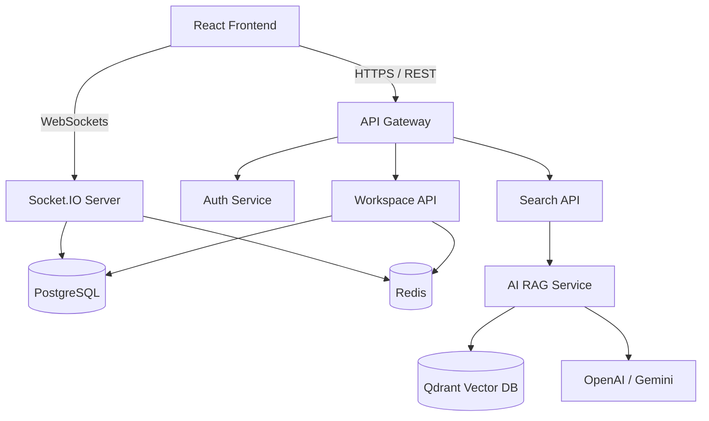

<div align="center">
  <h1>🌌 Nexus Workspace</h1>
  <p><strong>AI-Powered Collaborative Research & Productivity Platform</strong></p>
  <p><i>A collaborative workspace where teams can research, write, discuss, organize knowledge, and build AI-assisted documents in real time.</i></p>

  <!-- Add your badges here later! Example: -->
  <!--  -->
  <!--  -->
</div>

<br />

## 📖 About The Project

**Nexus Workspace** is an enterprise-grade productivity platform combining the best features of Notion, Google Docs, and ChatGPT into a single, unified environment. Built with a distributed microservices architecture, it enables teams to collaborate on rich-text documents in real-time, organize nested knowledge bases, and leverage powerful AI agents to analyze, summarize, and generate content dynamically.

### 🌟 Key Features

- **⚡ Real-Time Collaboration**: Google Docs-style live editing with cursor presence, typing indicators, and conflict resolution powered by Yjs (CRDTs) and WebSockets.
- **🧠 Embedded AI Assistant**: Context-aware AI integrated directly into the editor. Ask the AI to rewrite, summarize, generate code, or translate text inline.
- **🔍 RAG-Powered Research**: An autonomous research agent backed by a Qdrant vector database. Ask global workspace questions and get synthesized answers with citations.
- **📂 Dynamic Knowledge Base**: Create nested wiki pages, link documents bi-directionally, and organize workflows using drag-and-drop Kanban boards and infinite-canvas whiteboards.
- **💬 Team Communication**: Threaded chats, inline comments, document mentions, and push notifications to keep teams aligned.
- **🛡️ Enterprise Security**: Role-based access control (RBAC), JWT rotation, rate limiting, and robust input validation.

---

## 🏗️ Architecture & Tech Stack

Nexus Workspace is built as a highly scalable, containerized distributed system.

### Frontend
- **Framework**: React 19, TypeScript, Vite
- **State & Data Fetching**: Zustand, TanStack (React) Query
- **Styling**: Tailwind CSS, Framer Motion
- **Editor & Canvas**: Tiptap (or Lexical), React Flow
- **Real-Time**: Socket.io Client, Yjs

### Backend & Microservices
- **Server**: Node.js, Express, TypeScript
- **Database**: PostgreSQL (Relational Data), Prisma ORM
- **Caching & Queues**: Redis, BullMQ (Background Jobs)
- **Real-Time Server**: Socket.io
- **AI & Vectors**: OpenAI / Gemini APIs, Qdrant (Vector DB), Vercel AI SDK

### DevOps & Infrastructure
- **Containerization**: Docker, Docker Compose
- **CI/CD**: GitHub Actions
- **Monitoring**: Prometheus, Grafana

### High-Level System Architecture



---

## 🚀 Getting Started

### Prerequisites
- Node.js (v18+)
- Docker & Docker Compose
- PostgreSQL (or run via Docker)
- Redis (or run via Docker)
- OpenAI API Key

### Installation

1. **Clone the repository**
   ```bash
   git clone https://github.com/your-username/nexus-workspace.git
   cd nexus-workspace
   ```

2. **Install dependencies (Monorepo)**
   ```bash
   pnpm install
   ```

3. **Build internal packages**
   ```bash
   pnpm run build
   ```

4. **Set up environment variables**
   *(Note: Database & Auth configuration coming in Phase 2)*
   Copy `.env.example` to `.env` in the respective directories (`apps/web`, `apps/server`) once created.

5. **Spin up local infrastructure (DB, Redis, Qdrant)**
   ```bash
   docker-compose up -d
   ```

6. **Start the development servers**
   ```bash
   pnpm run dev
   ```
   *This triggers Turborepo to start the frontend, backend, and all package watchers simultaneously.*

---

## 📁 Project Structure (Turborepo / Monorepo)

```text
nexus-workspace/
├── apps/
│   ├── web/                 # React 19 Frontend
│   ├── server/              # Main Node.js Express API
│   ├── ai-service/          # Python/Node RAG & Embeddings Service
│   └── websocket-service/   # Dedicated Socket.io server
├── packages/
│   ├── ui/                  # Shared React components (Tailwind)
│   ├── shared/              # Shared types, Zod schemas, constants
│   ├── config/              # ESLint, TypeScript, Prettier configs
│   └── database/            # Prisma schema and generated client
├── infra/                   # Terraform/Docker configurations
└── docs/                    # Architecture Decision Records (ADRs) & API specs
```

---

## 🗺️ Development Roadmap

- [ ] **Phase 1: Foundation (Weeks 1-2)** - Monorepo setup, Auth (JWT/OAuth), PostgreSQL schema, basic Dashboard and Workspace CRUD.
- [ ] **Phase 2: Real-Time Engine (Weeks 3-4)** - Tiptap integration, Yjs setup, Socket.io presence, live collaborative editing.
- [ ] **Phase 3: AI & RAG Integration (Weeks 5-6)** - Vector DB setup, document chunking pipeline, AI Chat interface, inline AI editor actions.
- [ ] **Phase 4: Advanced Modules (Week 7)** - Kanban boards, Whiteboards, deep search, real-time notifications.
- [ ] **Phase 5: Polish & DevOps (Week 8)** - Dockerization, CI/CD pipelines, Prometheus monitoring, performance optimization, and final deployment.

---

## 📄 License

Distributed under the MIT License. See `LICENSE` for more information.
